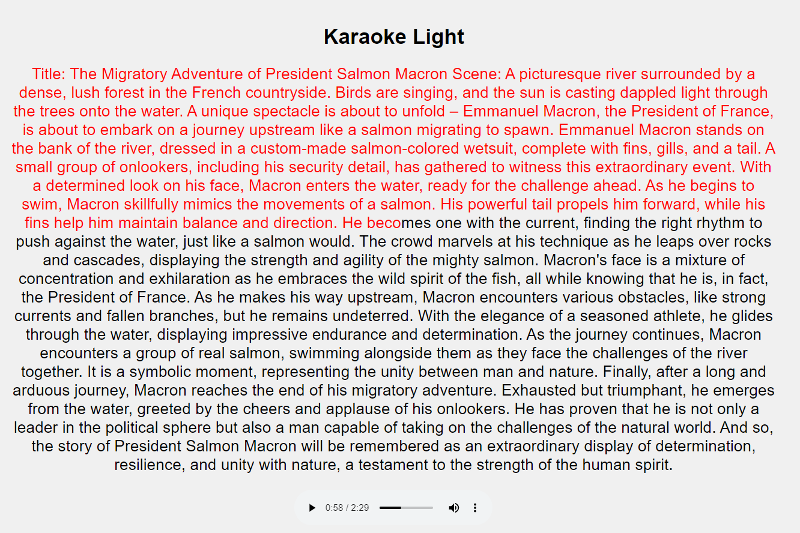

# 🎤 Karaoke Light

Text Karaoke is a simple web-based karaoke app that highlights text as the audio progresses. It provides a basic and easy-to-use interface for users to follow along with the text while listening to the audio.



## 🌟 Features

- Simple and lightweight interface
- No need for specific word timings
- Easily customizable text and audio content

## 🚀 Getting Started

To set up the Text Karaoke app, follow these steps:

1. Clone this repository or download the source files (index.html, styles.css, and script.js).

````bash
git clone https://github.com/louispaulet/karaoke_light.git
````

2. Open the `index.html` file in a text editor and replace the placeholder text with your own text.
3. Replace the `concat_sound4.wav` in the `index.html` file with the path to your own audio file (supported formats: .wav, .mp3, .ogg, etc.).
4. Save the changes and open the `index.html` file in a web browser to see the Text Karaoke app in action.

## 🎨 Customization

You can easily customize the appearance of the Text Karaoke app by modifying the `styles.css` file. Change the colors, fonts, and layout to match your desired style.

## ⚠️ Limitations

- The text highlighting is based on the percentage of the audio played, which may not perfectly match the audio.
- This simple implementation does not support complex synchronization or precise word timings.

## 💡 Contributing

Contributions to improve the Text Karaoke app are welcome. Feel free to submit issues, create pull requests, or suggest new features.

## 📄 License

Text Karaoke is released under the [MIT License](LICENSE).
